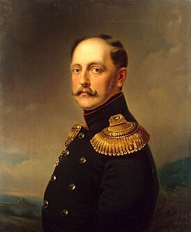

```{r setup, include=FALSE}
knitr::opts_chunk$set(echo = TRUE, message = FALSE, warning = FALSE, error = FALSE, fig.width=16, fig.height=10)

library(tidyverse)
```

## Data reading

```{r dataLoading}
hogwarts <- read_csv("data/hogwarts_2024.csv")
hogwarts |> head()
```

### Checking dataset structure

```{r}
hogwarts |> glimpse()

# Changing some variables type to factors
hogwarts <- hogwarts |> mutate(
  across(c(house, course, sex, wandCore, bloodStatus), ~ as.factor(.x))
)
```

### NA checking

```{r}
sum(is.na(hogwarts))
```

### Summary output

```{r}
hogwarts |> summary()
```

## Data visualisation

### 1 фактор


```{r}
ggplot()
  geom_
  theme_
  coord_
  scale_
  facet_


```

### Цвета


Пкорасим столбцы в отличный от серого цвет.

```{r}
ggplot(hogwarts)+
  geom_bar(aes(x = house))+ 
  theme_bw()
```

{width="500"}

Раскрасим факультеты в разные цвета

```{r}
ggplot(hogwarts)+
  geom_bar(aes(x = house), 
           colour = "black")+ 
  theme_bw()
```

Выделим один факультет цветом.

```{r}
ggplot(hogwarts)+
  geom_bar(aes(x = house), 
           colour = "black")+ 
  theme_bw()
```

```{r}
ggplot(hogwarts)+
  geom_bar(aes(x = house, 
               fill = house), 
           colour = "black")+ 
  theme_bw()
  
c("Gryffindor" = "#C50000", "Hufflepuff" = "#ECB939", "Ravenclaw" = "#41A6D9", "Slytherin" = "#1F5D25")
```

Резюме

1.  ggplot составляют 5 основных компонентов: геомы, оси, фасеты, координатная плоскость и тема
2.  Внутри геомов есть эстетики. Внутрь эстетик мы помещаем те переменные из данных, которые желаем видеть на графике. Это будут наши оси.
3.  Ось -- не только координата x и y -- любая эстетика, например, заливка, тоже может быть осью.
4.  Цвет в ggplot можно задать как словесно, так и при помощи гекскода.
5.  У цвета есть три основных применения -- различение групп, акцентирование подмножества объектов, отражение свойства, связанного с цветом.
6.  Можно подробно настроить оси при помощи опции scale (основные типы функций, которые пригождаются -- discrete, continuous и manual).
7.  Распределение 1-й категориальной/факторной/качественной/номинативной переменной можно представить в виде столбиковой диаграммы (барплота).

### 2 фактора

Добавим второй фактор

```{r}
ggplot(hogwarts)+
  geom_bar(aes(x = house),
           colour = "black")+ 
  theme_bw()
```

Место для ~~вашей рекламы~~ вашего графика

```{r}

```

Манипулируем темой.

```{r}
ggplot(hogwarts)+
  geom_bar(aes(x = fct_infreq(house), 
               fill = sex), 
           colour = "black", 
           position = "dodge2")+ 
  scale_x_discrete(name = "house")+
  theme_bw()
```

Резюме.

1\. У geom_bar есть аргумент position, который позволяет манипулировать взаиморасположением второй факторной переменной. Опция `dodge`/`dodge2` ставит столбики подгрупп внутри группы рядом, а опция `fill` укладывает их друг на друга в отшкалированном виде.

2\. Функции из семейства forcats (например, `fct_infreq()`) позволяют менять порядок факторных переменных.

3\. Функция `theme()` позволяет тонко регулировать различные оформительские аспекты графика. Например, размер и угол наклона шрифта. 

4\. Элементы ggplot можно сохранять в переменные и переиспользовать.

### 1 качественная переменная с большим числом градаций

```{r}
hogwarts |> 
  filter(id  %in% 1:40) |> 
  mutate(id = as.factor(id)) |> 
  ggplot()+
  theme_bw()+
  theme_custom
```

Место для вашего графика

```{r}

```

### Временные тренды

Отследим, как студенты приносили или отнимали баллы у факультета

```{r}
# Создадим новый субдатасет
students10ForWeeks <- hogwarts |> 
  select(id, starts_with("week")) |> 
  pivot_longer(!id, names_to = "week", values_to = "points") |> 
  filter(id  %in%  1:10) |> 
  mutate(
    week = week |> str_split_i("_", 2) |> as.numeric()
    )

# Отрисуем график
ggplot()+
  theme_bw()+
  theme_custom
```

"Подсветим" конкретного студента

```{r}
ggplot()+
  geom_line(data = students10ForWeeks, 
            aes(x = week, 
                y = points, 
                group = id))+
  theme_bw()+
  theme_custom
```

Резюме.

1\. Для категориальных переменных с большим числом категорий можно заменить барплот лоллипопом.

2\. На графики можно добавлять графические примитивы -- линии и фигуры, которые создают смысловой акцент, показывают отсечку и т.д.

3\. Изменения во времени хорошо передают лайнплоты.

4\. Если на лайнплоте слишком много линий, есть два хороших решения: убрать график или сделать акцентными нужные единицы наблюдения, убрав в тень остальные.

# 1 количественная переменная

Визуализируем количественную переменную.

```{r}
ggplot(hogwarts)+
  geom_bar(aes(x = result))+
  theme_bw()+
  Theme_custom
```

Иной подход к визуализации количественной переменной

```{r}
ggplot(hogwarts)+
  geom_bar(aes(x = result))+
  theme_bw()+
  theme_custom
```

И еще один.

```{r}

```

Малое количество наблюдений

```{r}
hogwarts |> 
  filter(course == 7, house == "Ravenclaw") |> 
  ggplot()+
  geom_density(aes(x = `Potions exam`), 
               fill = "turquoise1", 
               colour = "grey49", 
               bins = ceiling(log2(nrow(hogwarts))+1))+
  theme_bw()+
  theme_custom
```

### Сравнение нескольких количественных переменных

```{r}
ggplot(hogwarts)+
  geom_density(aes(x = `Potions exam`), 
               fill = "turquoise1", 
               colour = "grey49")+
  theme_bw()+
  theme_custom
```

Резюме.

1\. Распределение одной количественной (желательно непрерывной) переменной можно задать гистограммой или графиком плотности вероятности.

2\. Для хорошей визуализации гистограммы нужно моделировать число (или ширину) столбика.

3.  График плотности вероятности плохо работает на малых данных.

4\. При наложении нескольких гистограмм/графиков плотности вероятности, стоит сделать слои более прозрачными, используя аргумент `alpha`.

### 1 количественная переменная и фактор


Сравним несколько распределений

```{r}
ggplot(hogwarts)+
  theme_bw()+
  theme_custom
```

Сравниваем несколько переменных

```{r}

```

В чем плюсы и минусы двух этих представлений количественных переменных?

```{r}

```

А есть ли что-то, сочетающее их свойства?

```{r}
hogwarts |> 
  select(id, `Transfiguration exam`, `Potions exam`, `Defence against the dark arts exam`) |> 
  pivot_longer(!id, names_to = "exam", values_to = "score") |> 
  ggplot()+
  theme_bw()+
  theme_custom
```


Комбинируем разные слои

```{r}
hogwarts |> 
  filter(house == "Slytherin") |> 
  select(id, `Transfiguration exam`, `Potions exam`, `Defence against the dark arts exam`) |> 
  pivot_longer(!id, 
               names_to = "exam", 
               values_to = "score") |> 
  ggplot(aes(x = exam, 
             y = score))+
  theme_bw()+
  theme_custom
```

### 1 количественная и 2 факторные переменные

```{r}
hogwarts |> 
  filter(house == "Slytherin") |> 
  select(id, `Transfiguration exam`, `Potions exam`, `Defence against the dark arts exam`, sex) |> 
  pivot_longer(-c(id, sex), 
               names_to = "exam", 
               values_to = "score") |> 
  ggplot(aes(x = exam, y = score, fill = sex))+
  geom_boxplot(notch = TRUE, outliers = FALSE)+
  geom_jitter()+
  theme_bw()+
  theme_custom
  
```


```{r}
hogwarts |> 
  filter(house == "Slytherin") |> 
  select(id, `Transfiguration exam`, `Potions exam`, `Defence against the dark arts exam`, sex, wandCore) |> 
  pivot_longer(-c(id, sex, wandCore), names_to = "exam", values_to = "score") |> 
  ggplot(aes(x = exam, y = score, fill = sex, alpha = wandCore))+
  geom_boxplot(notch = TRUE, outliers = FALSE)+
  geom_jitter()+
  theme_bw()+
  theme_custom
```

Резюме.

1. Распределение количественной переменной можно представить в виде боксплота. На боксплоте мы видим несколько простых статистик (квартили, межквартильный размах) и выбросы, но не видим деталей распределения. 

2. Преодоелние предыдущей проблемы боксплота -- jitter и violin. Первый хорош для наборов данных с малым числом наблюдений, второй -- с большим. 

3. На одном графике можно сочетать не только геомы одного типа, но и разные. Например, сделать боксплот с джиттером. 

4. Справка по конкретным функциям позволяет узнать о разных опциях и настройках: например, на боксплоте мы можем убрать выбросы или добавить вырезку. 

5. Боксплоты, как и барплоты, можно разбивать по категориям.

### Еще один способ сравнить распределения по группам

```{r}
ggplot(hogwarts)+
  geom_histogram(aes(x = `Potions exam`), 
                 fill = "turquoise1", 
                 colour = "grey49", 
                 bins = 20)+
  theme_bw()+
  theme_custom
```

```{r}
ggplot(hogwarts)+
  geom_boxplot(aes(y = `Potions exam`), 
                 fill = "turquoise1", 
                 colour = "grey49", 
                 bins = 20)+
  theme_bw()+
  theme_custom
```

И немного другой подход

```{r}
ggplot(hogwarts)+
  geom_histogram(aes(x = `Potions exam`), 
                 fill = "turquoise1", 
                 colour = "grey49", 
                 bins = 20)+
  facet_wrap(vars(course))+
  theme_bw()+
  theme_custom+
  theme(strip.text = element_text(size = 15))
```

### Распределение 2-х количественных переменных

```{r}
hogwarts |> 
  ggplot()+
  geom_histogram(aes(x = `Charms exam`),
                 colour = "black", 
                 fill = "lightgreen")+
  geom_histogram(aes(y = `Transfiguration exam`),
                 colour = "black", 
                 fill = "lightgreen")+
  theme_bw()+
  theme_custom
```

```{r}
hogwarts |> 
  ggplot()+
  theme_bw()+
  theme_custom
```


Побудем пигмалионами -- поработаем с формой

```{r}
hogwarts |> 
  ggplot()+
  geom_point(aes(x = `Charms exam`, y = `Transfiguration exam`))+
  theme_bw()+
  theme_custom
```

```{r}
hogwarts |> 
  mutate(course = as.factor(course)) |> 
  ggplot()+
  geom_point(aes(x = `Charms exam`, 
                 y = `Transfiguration exam`), 
             size = 3)+
  theme_bw()+
  theme_custom

values = c("1" = 49, "2" = 50, "3" = 51, "4" = 52, "5" = 53, "6" = 54, "7" = 55)
```

```{r}
hogwarts |> 
  mutate(course = as.factor(course)) |> 
  ggplot()+
  geom_point(aes(x = `Charms exam`, 
                 y = `Transfiguration exam`, 
                 shape = course, 
                 colour = course), 
             size = 3)+
  scale_shape_manual(values = c("1" = 49, "2" = 50, "3" = 51, "4" = 52, "5" = 53, "6" = 54, "7" = 55))+
  theme_bw()+
  theme_custom+
```

Резюме. 

1. Стандартный инструмент для визуализации двух количественных переменных -- диаграмма рассеяния. 

2. Если необходимо добавить на график еще 1 факторный признак -- выделяем его цветом. 

3. Размер не лучшая опция для использования "в соло", но может добавить выразительности в сочетании с цветом. 

4. При большой кучности точек в определенных позициях полезно использовать `jitter` для случайного перемешивания. 

5. Аннотации помогают подсветить важную деталь в данных. Или намекнуть, что лекция подошла к концу.



Ссылочная

-   [Сайт с примерами графиков и полезными советами](https://r-graph-gallery.com/)
-   [Оригинальная статья с изложением философии ggplot](https://byrneslab.net/classes/biol607/readings/wickham_layered-grammar.pdf)
-   [Документация ggplot](https://ggplot2.tidyverse.org/)
-   [Учебник по data-science от авторов ggplot](https://r4ds.hadley.nz/)
-   [Книга о некоторых принципах визуализации с полезными советами, но без явного отображения кода](https://clauswilke.com/dataviz/)
-   [Учебник по ggplot от авторов ggplot (в процессе написания)](https://ggplot2-book.org/)
-   [Телеграм-канал про визуализацию (не в биомедицине, и не на R, но от этого не менее хороший)](https://t.me/nastengraph)
-   [Шпаргалка по ggplot2](https://rstudio.github.io/cheatsheets/html/data-visualization.html)
-   [Шпаргалка по rmd](https://posit.co/wp-content/uploads/2022/10/rmarkdown-1.pdf)